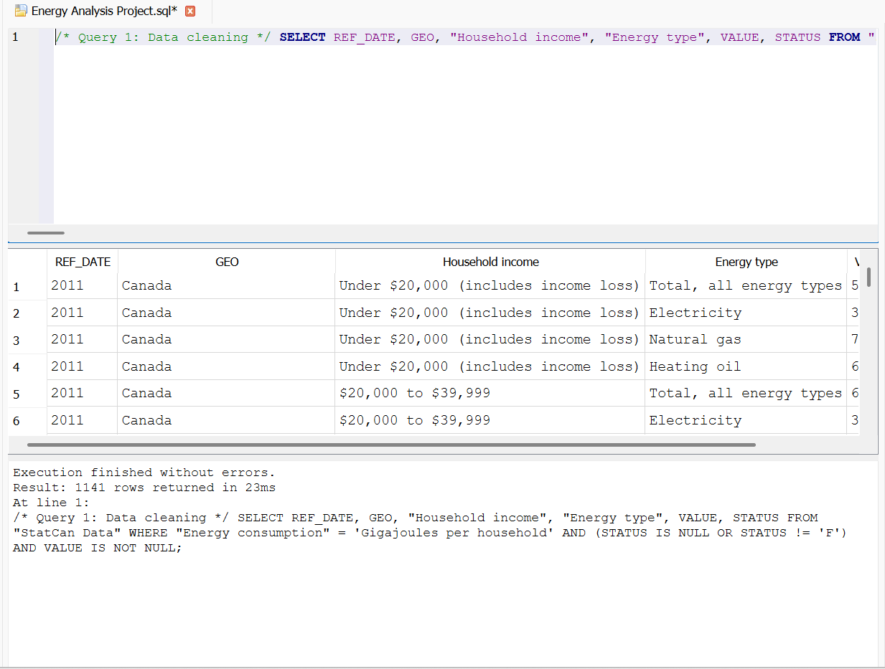
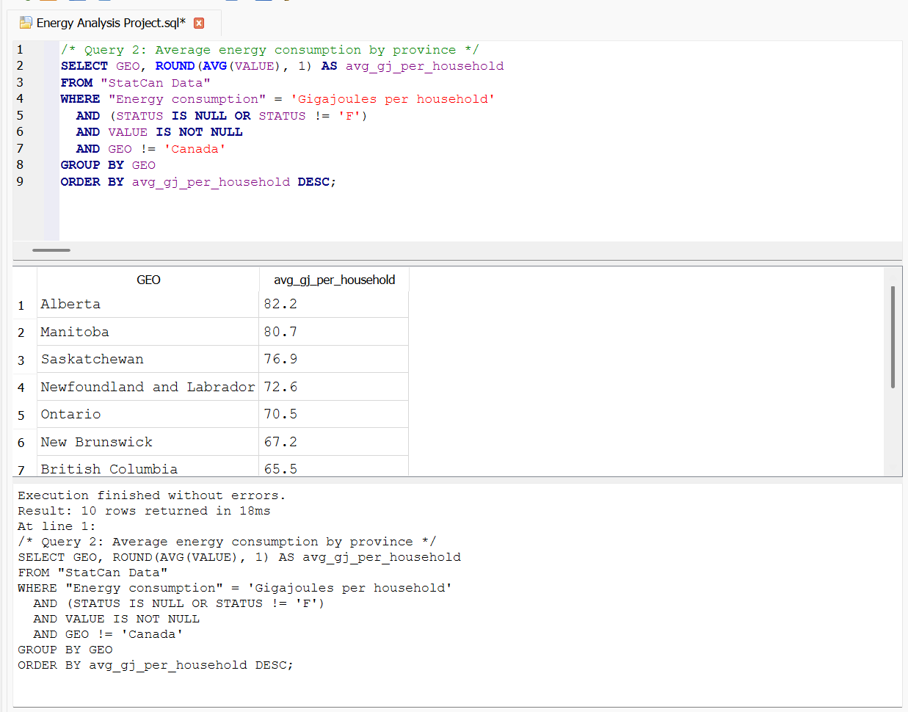
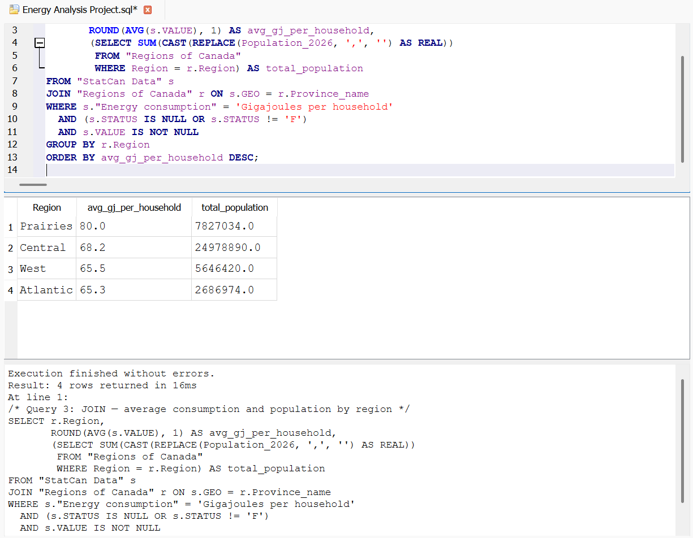

# Household-Energy_SQL_Analysis

Household Energy Consumption Analysis Across Canada Using Statistics Canada Dataset

## Overview
This project analyzes household energy consumption across Canadian provinces using SQL, answering questions about regional energy use, per-capita consumption, and how individual provinces compare to the national average. It pairs with an interactive Power BI dashboard built on the same data (link below).

## Data Sources
- **statcan_energy_data.csv** — Statistics Canada, Household energy consumption by income (Table 25-10-0062-01), raw and unfiltered
- **regions_of_canada.csv** — Provinces mapped to region (Atlantic/Central/Prairies/West) and population, compiled manually from Statistics Canada population estimates (April 2026)

## Queries
The `.sql` file contains five queries, each answering a distinct question:

1. **Data cleaning** — filters the raw data to reliable rows only, excluding StatCan's "too unreliable to publish" (STATUS = 'F') flags and blank values

2. 
3. **Aggregation** — average household energy consumption (Gigajoules) by province

4. 
5. **JOIN** — joins the energy data to the province/region lookup table to compute average consumption and total population by region

6. 
7. **Window function** — ranks provinces by energy consumption within their own region using `RANK() OVER (PARTITION BY ...)`
8. **CTE / subquery** — compares each province's average consumption to the national benchmark, calculated once via a CTE

## A bug worth mentioning
While building the JOIN query, the population totals came back far too small (e.g. 765 instead of millions). The cause: the population column contained comma thousand-separators as literal text (e.g. "5,057,077"), and SQLite's `CAST(... AS REAL)` silently truncates at the first non-numeric character rather than erroring. Fixed with `REPLACE(Population_2026, ',', '')` before casting, combined with a scoped subquery so the population sum wasn't multiplied by the number of matching energy-data rows.

## Cross-validation
The national benchmark calculated here (**70.1 GJ**) matches the "National Average (Canada)" card in the companion Power BI dashboard (**70.10 GJ**) almost exactly — independent confirmation that both the SQL logic and the DAX measure are correct.

## Related Project
Interactive Power BI dashboard using the same dataset:[View the dashboard](https://app.powerbi.com/view?r=eyJrIjoiMWFlMjQxZTUtNTVlYi00MjMzLWIzODAtMzk3MjE3ZDQyZjE3IiwidCI6ImM3ZTc5YjlkLWVjZTktNDEzMy04NzQzLWI2Y2FkMjZjNTc0ZiIsImMiOjEwfQ%3D%3D)
